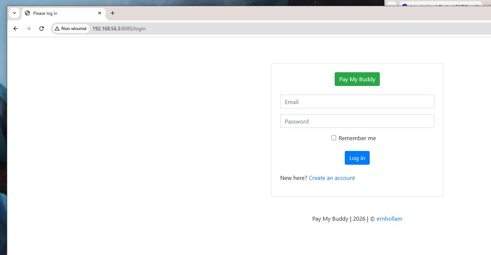
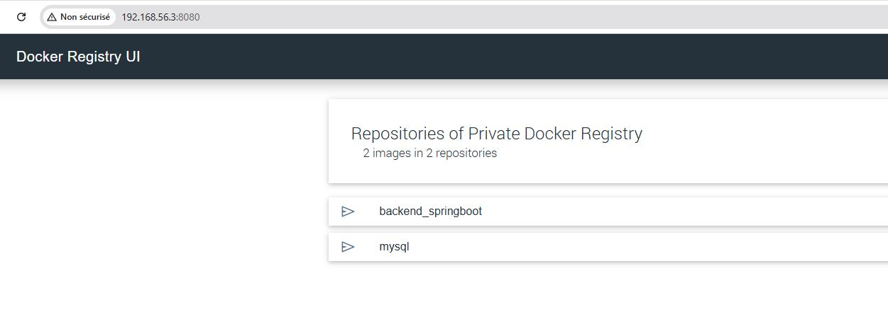

</> Markdown

Le but du projet est, dans un premier temps, de créer un Dockerfile basé sur le framework Spring Boot.
L’interface utilisateur (UI) devra être accessible via le port 80 et communiquer avec une base de données MySQL disponible sur le port 3306.

Dans un second temps, il faudra créer un fichier docker-compose.yml regroupant :

- l’application backend_springboot:V1 ( backend_springboot:V1 etant le nom de mon dockerfile buildé  pour le backend springboot)
- la base de données MySQL s'appuyant sur une image officiel mysql ==> mysql:8.0

afin de permettre à l’application d’accéder à la base MySQL via le port 3306.

Nota :
Les variables nécessaires à la connexion à la base MySQL (nom d’utilisateur, mot de passe, etc.) devront être renseignées dans un fichier .env.
Ce fichier ne devra pas être envoyé dans le projet afin de préserver la confidentialité des informations sensibles ==> donc dans mon .gitignore.

Chaque utilisateur pourra ainsi créer son propre fichier .env en local avec ses identifiants afin de lancer l’application avec la commande ==> docker compose up -d :
a completer dans le fichier .env à votre convenance 
MYSQL_USER=xxxxxxxx
MYSQL_PASSWORD=yyyyyyyyy

SPRING_DATASOURCE_USERNAME=xxxxxxxx 
SPRING_DATASOURCE_PASSWORD=yyyyyyyyy

pour l'exiercie j'ai creer un regritry en local sur mon localhost en http voir screen  mais en entreprise il faudrait securisé le registre afin de le joindre à distance pour recuperer les images par n'impote qui ==> generer un certificat en TLS 

</> Markdown

